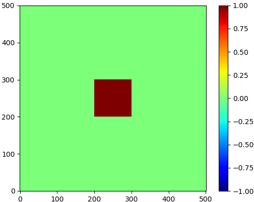

# Setup sample in 2D FO Simulation

To setup the sample, user need to config a numpy array (np.array) named `simulatedObject` generated by a function `create2DSimulatedObject()` in `FO2Dconstants.py`.

During the simulation, the np.array `simulatedObject` is generated by running `create2DSimulatedObject()` within `main()` in `run2DFOSimulation.py`. Therefore, user **must** specify the array within `create2DSimulatedObject()` by generate it or loading a `.npy` file.

(**Note**: User have to make sure that the loaded np.array have the same dimension with `simulatingSpaceTotalStep` in `FO2Dconstants.py`. Because, within the `main()` function, the dimension of `simulatedObject` is not checked against `simulatingSpaceTotalStep` in `FO2Dconstants.py`.)
      

## Preview sample
To preview the sample user can run `FO2Dconstants.py` by itself, a plot of `simulatedObject` is generated accordingly.

For example we generate a square step object with amplitude 1 with the object 0 outside:

```python 

def create2DSimulatedObject():
    # define a zero array with dimension simulatingSpaceTotalStep by simulatingSpaceTotalStep.
    # simulatingSpaceTotalStep definition is load by "from FO2Dconstants import *"
    simulatedObject = np.zeros((simulatingSpaceTotalStep,simulatingSpaceTotalStep))

    #define the square step object
    amp = 1
    simulatedObject[251 - 50:251 + 50, 251 - 50:251 + 50] = amp

    return simulatedObject

```


After that we run `FO2Dconstants.py` in terminal:

    python FO2Dconstants.py
    
Output:

